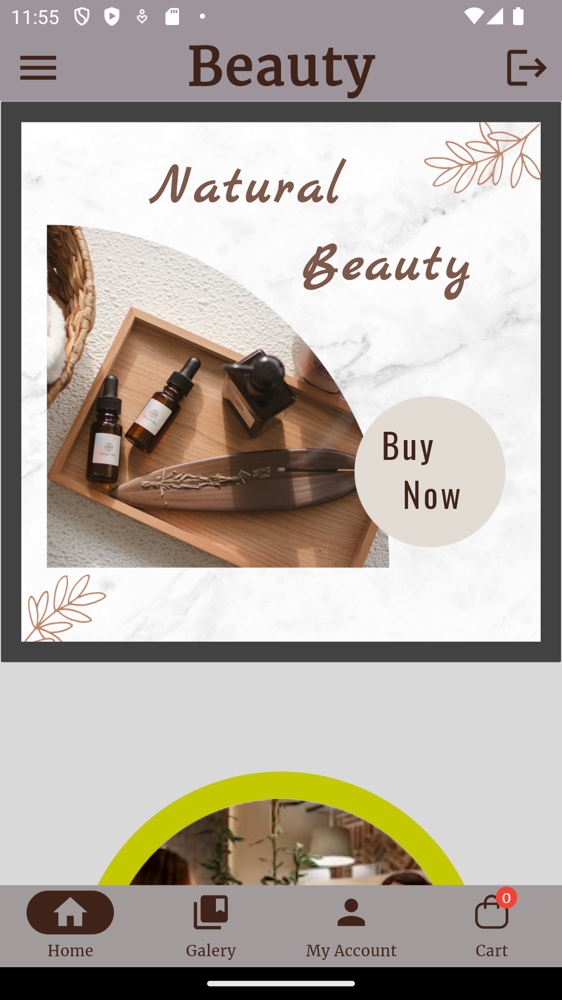
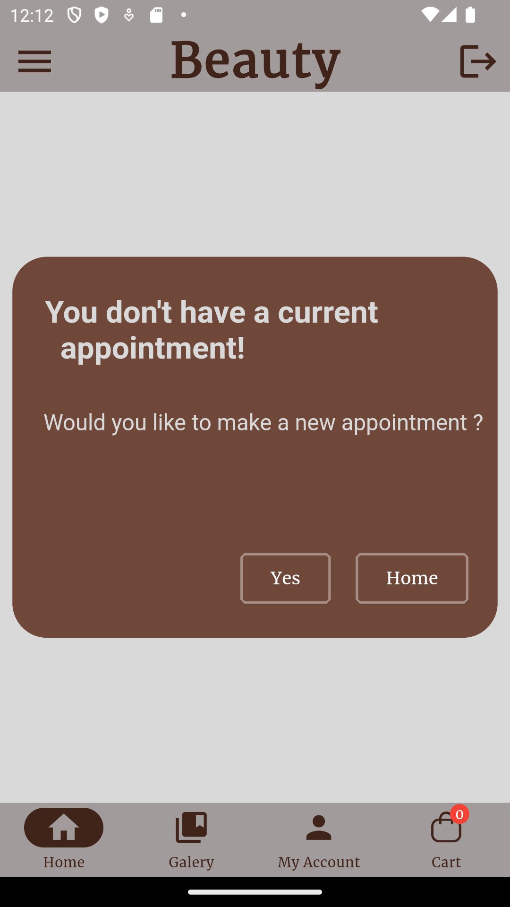
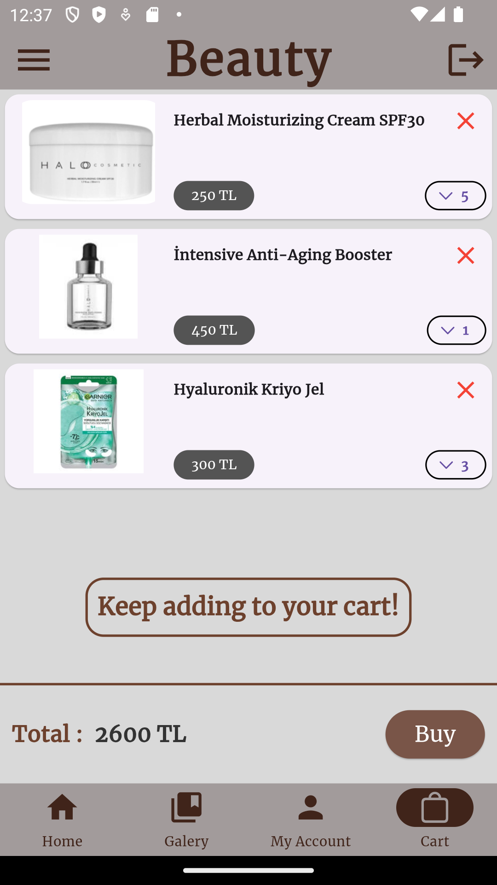
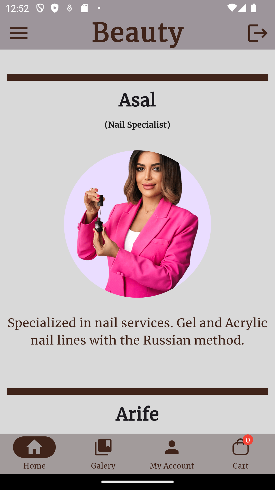

    <h2 align="center">Ladies Hairdresser Appointment System Mobile Application</h2>    
    

        
    

    
                
        Erciyes University Graduation Thesis
             
        <a href="https://drive.google.com/file/d/1M3n9SP5wsAwJCk9v1WEFC_2bHBysnB84/view"> View Report <a>
    

 
            
##

[Download the application APK file](<build/app/outputs/flutter-apk/app-release.apk>)

##

 

    
Table of Contents

  <ol>
    <li>
      <a href="#about-the-project">About The Project</a>      
    </li>
    <li>
      <a href="#features">Features</a>      
    </li>
    <li>
        <a href="#resources">Resources</a>
    </li>        
  </ol>

## About The Project

The project is a part of the senior university project. Today, with the rapid advancement of technology, the hairdressing industry is also getting its share of this transformation. In this context, the "Ladies Hairdresser Appointment Tracking System" application we offer aims to facilitate customer tracking, appointment management, service optimization and product sales by bringing a modern touch to hairdressing salons. This application, developed with Flutter technology, aims to provide a digital advantage to hair salon businesses by providing a user-friendly experience on mobile platforms..

### Tools Used

- [Visual Studio Code][https://code.visualstudio.com/]
- Flutter - Dart
- Firebase database and Firebase Authentication
- Easy Localization

  

## Features

- Online appointment 
- Product sales and Information
- Employee Information
- User Account Information and Editing
- Business Information 
- Basic service categories offered by the business
- Visual References

  

### Login and SignUp Screen

    &nbsp;&nbsp;&nbsp;&nbsp;&nbsp;
    &nbsp;&nbsp;&nbsp;&nbsp;&nbsp;
    &nbsp;&nbsp;&nbsp;&nbsp;&nbsp;
    

  

### Home Screen

    &nbsp;&nbsp;&nbsp;&nbsp;&nbsp;
    &nbsp;&nbsp;&nbsp;&nbsp;&nbsp;
    &nbsp;&nbsp;&nbsp;&nbsp;&nbsp;
    &nbsp;&nbsp;&nbsp;&nbsp;&nbsp;
    &nbsp;&nbsp;&nbsp;&nbsp;&nbsp;
    &nbsp;&nbsp;&nbsp;&nbsp;&nbsp;
    &nbsp;&nbsp;&nbsp;&nbsp;&nbsp;
    &nbsp;&nbsp;&nbsp;&nbsp;&nbsp;
    &nbsp;&nbsp;&nbsp;&nbsp;&nbsp;
    &nbsp;&nbsp;&nbsp;&nbsp;&nbsp;

### Apoointment Page

  

    &nbsp;&nbsp;&nbsp;&nbsp;&nbsp;
    &nbsp;&nbsp;&nbsp;&nbsp;&nbsp;
    &nbsp;&nbsp;&nbsp;&nbsp;&nbsp;
    &nbsp;&nbsp;&nbsp;&nbsp;&nbsp;
    &nbsp;&nbsp;&nbsp;&nbsp;&nbsp;
    &nbsp;&nbsp;&nbsp;&nbsp;&nbsp;
    &nbsp;&nbsp;&nbsp;&nbsp;&nbsp;
    &nbsp;&nbsp;&nbsp;&nbsp;&nbsp;

  

### Galery Page

    &nbsp;&nbsp;&nbsp;&nbsp;&nbsp;
    &nbsp;&nbsp;&nbsp;&nbsp;&nbsp;
    &nbsp;&nbsp;&nbsp;&nbsp;&nbsp;
    &nbsp;&nbsp;&nbsp;&nbsp;&nbsp;

  

### Product Page

    &nbsp;&nbsp;&nbsp;&nbsp;&nbsp;
    &nbsp;&nbsp;&nbsp;&nbsp;&nbsp;
    &nbsp;&nbsp;&nbsp;&nbsp;&nbsp;
    &nbsp;&nbsp;&nbsp;&nbsp;&nbsp;
    &nbsp;&nbsp;&nbsp;&nbsp;&nbsp;
    &nbsp;&nbsp;&nbsp;&nbsp;&nbsp;

  

### Account Page

    &nbsp;&nbsp;&nbsp;&nbsp;&nbsp;
    &nbsp;&nbsp;&nbsp;&nbsp;&nbsp;
    &nbsp;&nbsp;&nbsp;&nbsp;&nbsp;

  

### About Page

    &nbsp;&nbsp;&nbsp;&nbsp;&nbsp;
    &nbsp;&nbsp;&nbsp;&nbsp;&nbsp;
    &nbsp;&nbsp;&nbsp;&nbsp;&nbsp;
     &nbsp;&nbsp;&nbsp;&nbsp;&nbsp;

 
 

## Resources

1. Basic flutter

   - youtube, udemy & documentations, any resource is enough

2. state management in flutter

   - [Bloc + Cubit]
   - [Provider]

   ##### some minor details

   - Cubit : for state that fetches data from API (CRUD)
   - Cubit_CUD : cubit that deals with Create, Upate & Delete operation
   - Cubit_R : cubit that deals with Read operation
   - provider : for local UI state (ex. toggling login & register screen, detecting current open tab etc)
   - Setstate : (for quick & rough implementation, can be improved with cubit or provider)

3. Flutter app design architecture

   - MVC
   - MVVM

 
## Developed By:
@Copyright
- Sefer Can Gültekin

